# Open research questions and decision gates

## Current Core research questions

| ID | Question | Status | Evidence needed before closing |
|---|---|---|---|
| Q1 | Which peer-reviewed 2025–2026 RGB SOT tracker has the strongest combination of reproducibility, competitive accuracy, researchable computational redundancy, and Jetson Nano deployment headroom? | **OPEN** | Systematic literature/code screening, official implementation audit, compute/training profile. |
| Q2 | What specific computation in the selected tracker is unnecessary, over-provisioned, or insufficiently adaptive across easy versus difficult tracking states? | **OPEN** | Architecture/code instrumentation, per-module profiling, token/memory/search-path analysis. |
| Q3 | Which robustness weakness remains scientifically meaningful after 2023–2026 novelty auditing? | **OPEN** | Primary-paper review, author limitations, benchmark/failure analysis, novelty-adversary matrix. |
| Q4 | Can one algorithmic mechanism reduce average computation while preserving or improving difficult-case robustness rather than treating compression and robustness as unrelated modules? | **OPEN** | Reproduced baseline, controlled ablations, matched accuracy-efficiency comparison. |
| Q5 | Can the selected research workflow train proposed modules and meaningfully fine-tune the network on a single RTX 3060 12 GB? | **OPEN** | Actual VRAM/time profiling, freeze/unfreeze ablations, training logs. |
| Q6 | Can the final Core reach a credible Jetson Nano B01 4 GB operating point after reasonable optimization? | **OPEN** | Actual Nano measurements: end-to-end FPS, latency, RAM, long-run stability, export accuracy. |
| Q7 | Does the Core contribution remain valuable without person-specific identity/ReID logic? | **OPEN** | Generic benchmark and ablation results independent of Layer B. |

## Later target-person extension questions

| ID | Question | Status | Evidence needed before closing |
|---|---|---|---|
| P1 | How should `target_type = person` activate identity verification, person memory, ReID, and presence/recovery without changing the declared generic SOT protocol? | **DEFERRED** | Core tracker selected and validated first. |
| P2 | Can the extension preserve same-person identity after long disappearance/re-entry and avoid wrong-person relock? | **DEFERRED** | TPT-Bench plus explicit wrong-person/recovery analysis. |
| P3 | Does optional detector assistance in LOST/recovery improve robot deployment without contaminating pure SOT claims? | **DEFERRED** | Separate detector-assisted protocol and ablations. |

## Candidate Core hypothesis template

No final hypothesis is locked until the baseline is selected and its redundancy/weakness is demonstrated.

Preferred hypothesis form:

> **HYPOTHESIS TEMPLATE — untested.** A tracker state-aware computation mechanism can reduce unnecessary average computation on reliable/easy frames while preserving or increasing capacity on difficult/uncertain frames, yielding a better accuracy–efficiency trade-off than the matched baseline under the same training/evaluation protocol.

The exact mechanism may involve token routing, memory/template selection, adaptive depth/width, dynamic search, reliability-aware computation, or another baseline-specific design. The mechanism must be derived from measured evidence rather than selected in advance.

## Gates before substantial architecture work

```mermaid
flowchart LR
    A[Scope locked] --> B[2025-2026 systematic screening]
    B --> C[2-3 candidate shortlist]
    C --> D[Official baseline reproduction]
    D --> E[Profile redundancy + verify weakness]
    E --> F[Novelty gate]
    F --> G[Proposed mechanism]
    G --> H[Controlled generic benchmarks]
    H --> I[Jetson Nano benchmark]
    I --> J[Target-person extension]
```

Each gate can reject the current candidate. A later gate never repairs missing evidence at an earlier gate.

## Controlled-comparison rule

Keep two kinds of result separate:

1. **Official reproduction:** reproduce official checkpoint/config/evaluator to verify implementation consistency.
2. **Controlled scientific comparison:** baseline and proposed model use matched training data/protocol/budget wherever appropriate.

If the proposed method requires a changed training objective or architecture, the difference must be declared and isolated through ablation.

## Core success condition

A Core result is not considered successful merely because it exports to TensorRT or uses fewer parameters.

A successful Core should show evidence for all of the following:

- real algorithmic change;
- measurable efficiency gain in at least multiple dimensions (not parameters alone);
- generic accuracy preserved or improved, with at most a small declared loss when justified by substantial efficiency gain;
- robustness weakness improved or at minimum not worsened in the intended difficult regime;
- reproducible training/evaluation;
- actual Jetson Nano profiling;
- contribution remains meaningful before the person-specific extension is attached.
