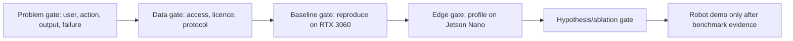

# Open research questions and decision gates

## Current questions

| ID | Question | Status | Evidence needed before closing |
|---|---|---|---|
| Q1 | Can the selected scope preserve the correct identity after occlusion/out-of-view re-entry rather than merely keep a box near a person? | **OPEN** | TPT-Bench protocol result and targeted wrong-person analysis. |
| Q2 | Which failure mode is sufficiently under-served by a reproducible lightweight baseline to justify a method improvement? | **OPEN** | Literature/novelty audit plus reproduced baselines. |
| Q3 | Which public data are legally accessible and fit for training versus held-out evaluation? | **OPEN** | Current dataset licence, access, split, and storage audits. |
| Q4 | Which lightweight tracker family can reproduce on RTX 3060 and pass Nano profiling? | **OPEN** | Checkpoint/repository audit, server reproduction, and target-device measurement. |
| Q5 | Does a later guide/accompany robot demonstration need active control, and which task-level metric would it use? | **OPEN** | Application contract and safety/control protocol. |

## Candidate scientific hypothesis

**HYPOTHESIS — untested.** Under an equal training-data, optimizer, and compute budget, a lightweight RGB SOT modification designed for identity-preserving recovery will improve a predeclared long-occlusion/re-entry or wrong-instance metric over its matched baseline, without unacceptable loss on generic long-term tests.

This is intentionally not an algorithm proposal yet. It becomes a valid hypothesis only after choosing a baseline, exact failure metric, protocol, and ablations.

## Gates before substantial training

Each gate may reject or narrow the project. Passing a later gate never repairs missing evidence at an earlier one.
